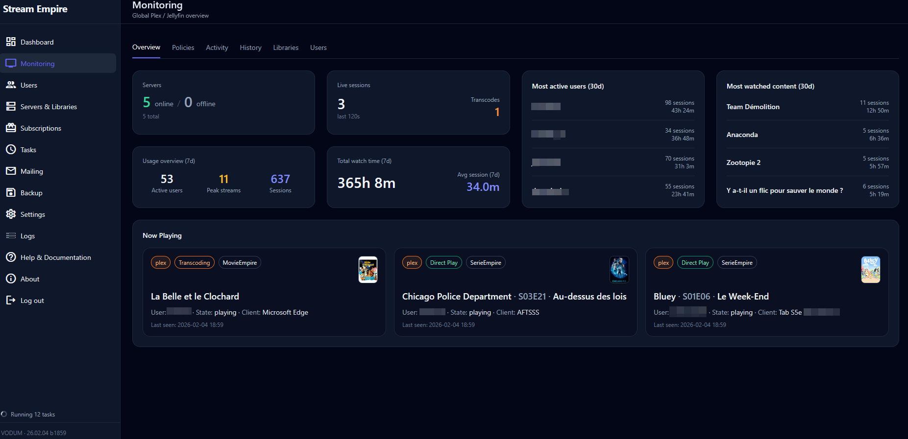

<!-- Auto-generated improved docs for GitHub Pages (MkDocs Material) -->

# 👁 Monitoring

Overview • Policies • Activity • History • Libraries • Users • Servers

  

  

The Monitoring section is designed to answer a simple question:

> “What is happening right now in VODUM — and why?”

It provides multiple tabs focused on **visibility** and **diagnostics**, without forcing you to jump across settings pages.

---

## 🧭 Tabs

### ✅ Overview
Global situation at a glance:
- active vs expired
- warnings due
- quick system summary

### ⚠ Policies
Shows which users are currently matched by:
- warning rules
- disable-on-expiration rules

This tab is your “truth table” to validate policy targeting.

### 🟣 Activity
A real-time feed of user/system activity.

!!! tip
    Activity refresh is faster than other tabs to stay readable in production.

### 🕘 History
Historical view of actions/events (useful for audits).

### 📚 Libraries
Visibility on libraries & access status across servers:
- what libraries exist
- what a user can access
- potential mismatches

### 👤 Users
Monitoring-oriented view of users (status badges, quick navigation).

### 🖥 Servers
Live server status view:
- online/offline
- last checks
- quick diagnostics

---

## 🔎 Search behavior

Monitoring uses the same philosophy as the Users module: search should be practical.

Depending on the tab, the search may include:
- username
- first name / last name
- email / secondary email
- notes

---

## ✅ Best practices

- If a user complains about access:
  1. Monitoring → Policies (is user targeted?)
  2. Subscriptions (expiration date correct?)
  3. Libraries (access correct per server?)
  4. Logs (what was applied and when?)
