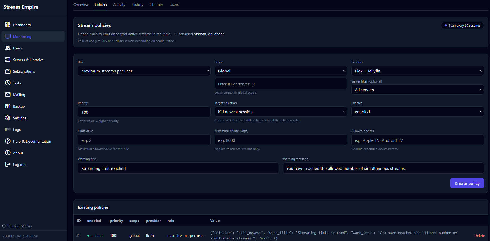

<!-- Auto-generated improved docs for GitHub Pages (MkDocs Material) -->

# ⚠ Policies

Warning • Disable on expiration • Users & merged users • Automation

  

  

Policies are the rules that VODUM uses to **warn** users before expiration and/or **disable access** once expired.

---

## ✅ What policies can do

### 1) Warning policy
Send notifications when the subscription is approaching its end.

Typical use:
- Warn **X days** before expiration
- Send one or multiple reminders (depending on your configuration)

### 2) Disable policy (on expiration)
Automatically remove access when a subscription is expired.

Important: VODUM focuses on **access control**, not user deletion.

---

## 👥 Who is targeted?

Policies are evaluated for:

- **Users**
- **Merged users** (if your setup uses merged identity / duplicates consolidation)

!!! note
    The Monitoring “Policies” tab is the best place to verify which users are currently matched by a policy.

---

## 🔁 When are policies applied?

Policies are **enforced by scheduled tasks**.

- If tasks are disabled, Monitoring may show a user as “should be disabled”, but nothing will be applied until tasks run.
- If the container is stopped, tasks won’t run until it comes back (see [Tasks](tasks.md)).

---

## 🧪 Recommended workflow

1. Configure policies
2. Configure notification channels (Mailing / Discord)
3. Run a **dry test**:
   - open Monitoring → Policies
   - validate the targeted list
4. Enable tasks and monitor Logs

---

## 🧯 Common pitfalls

??? question "Users appear in Policies but shouldn't"
    - Verify the user expiration date in Subscriptions
    - Verify merged users mapping (if enabled)
    - Check Monitoring → Policies list filters
    - Review task logs to confirm what logic was applied

??? question "Policies exist but nothing happens"
    - Confirm tasks are running (Tasks page)
    - Check container uptime / cron configuration
    - Check logs for task failures
